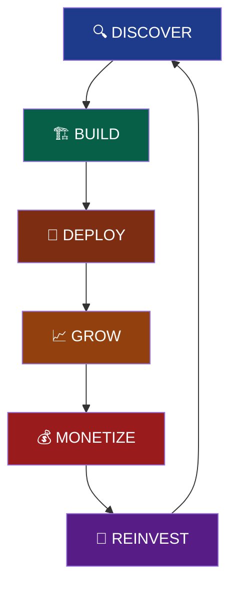
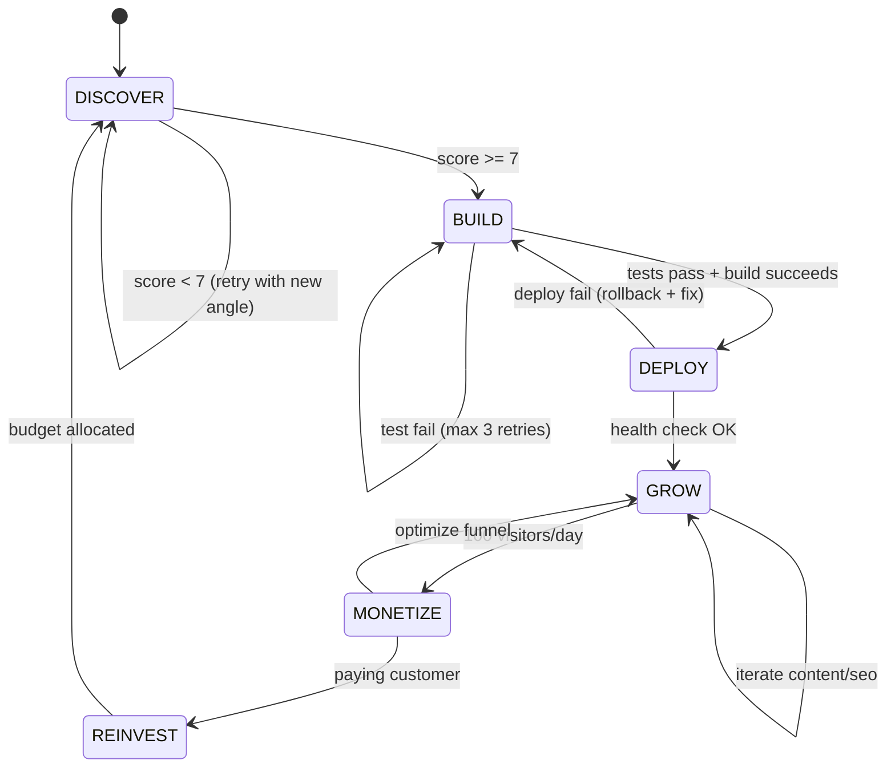

# Ultraplan — Dynamic Workflow Graph

**Version:** 1.0  
**Generated:** 2026-09-28  
**Agent:** Hermes (kimi-k3 / NVIDIA NIM)  
**Repo:** `ultraplan-business`  
**Super Goal:** *Build, deploy, and operate a zero-to-revenue SaaS business from scratch using autonomous AI agents — continuously.*

---

## 🎯 Super Goal (North Star)

> **Autonomous Business Loop** — An agent system that:  
> 1. **Discovers** viable micro-SaaS opportunities (market + tech fit)  
> 2. **Builds** MVP → deploys → monitors  
> 3. **Sells** via automated outreach + SEO + paid  
> 4. **Optimizes** pricing, churn, LTV/CAC  
> 5. **Reinvests** profit → next product (compound loop)  
> 6. **Never stops** — each cycle feeds the next

**Success Metric:** $10k MRR within 90 days, then $100k MRR within 12 months, fully agent-operated.

---

## 🔄 Core Loop (The Flywheel)



### Phase Details

| Phase | Agent(s) | Tools/Skills | Output | Gate |
|-------|----------|--------------|--------|------|
| **DISCOVER** | Research + Analyst | `web-search`, `arxiv`, `competitor-news-monitor`, `github` (trending) | `opportunity.md` (TAM, pain, tech stack, score) | Score ≥ 7/10 |
| **BUILD** | Architect + Coder + QA | `codebase-inspection`, `filesystem`, `github`, `code-execution` | Repo + CI + tests | `vercel deploy --prod` succeeds |
| **DEPLOY** | DevOps | `vercel-deploy`, `vercel` MCP, `github` (actions) | Live URL + monitoring | Health check 200 OK |
| **GROW** | Growth + SEO + Content | `web-search`, `youtube-content`, `gif-search`, `github` (issues) | Traffic + signups | 100 visitors/day |
| **MONETIZE** | Sales + Billing | `email-inbox-triage`, `stripe` (MCP), `notion` (CRM) | First $1 → $100 → $1k MRR | Paying customer |
| **REINVEST** | Capital Allocator | `arxiv` (R&D), `github` (next repo) | Next opportunity budget | ROI > 3x |

---

## 🤖 Agent Swarm Architecture

```
┌─────────────────────────────────────────────────────────────┐
│                    ORCHESTRATOR (Hermes)                    │
│  • Holds Super Goal & Loop State                            │
│  • Spawns subagents via `delegate_task`                     │
│  • Manages fallback chain (5 models)                        │
│  • Persists context in `state.db` + `memory/`               │
└─────────────────────┬───────────────────────────────────────┘
                      │ delegate_task
        ┌─────────────┼─────────────┐
        ▼             ▼             ▼
   ┌────────┐    ┌────────┐    ┌────────┐
   │RESEARCH│    │ BUILD  │    │ GROWTH │
   │ AGENT  │    │ AGENT  │    │ AGENT  │
   └────┬───┘    └────┬───┘    └────┬───┘
        │             │             │
   ┌────┴───┐    ┌────┴───┐    ┌────┴───┐
   │Skills  │    │Skills  │    │Skills  │
   │web-    │    │filesys │    │vercel- │
   │search  │    │tem     │    │deploy  │
   │arxiv   │    │github  │    │email   │
   │comp-   │    │code-ex │    │notion  │
   │news    │    │exec    │    │stripe  │
   └────────┘    └────────┘    └────────┘
```

### Subagent Config (delegation)
```yaml
# In config.yaml → delegation:
delegation:
  provider: "nvidia"                    # Same provider, free tier
  model: "nvidia/nemotron-3-ultra-550b-a55b"  # Fast, reliable fallback
  fallback_providers: []                # Inherits parent chain
  max_concurrent: 3                     # Parallel subagents
```

---

## 📦 State Persistence (Loop Memory)

| Store | Purpose | Tool |
|-------|---------|------|
| `state.db` | Conversation + tool calls + decisions | Built-in SQLite (WAL) |
| `memory/` | Long-term facts, patterns, learnings | `memory` skill + `obsidian` |
| `checkpoints/` | Rollback points per phase | `hermes checkpoints` |
| `C:\Business\` | Source code + artifacts | `filesystem` MCP + git |
| GitHub | Versioned history + issues + actions | `github` MCP + `gh` CLI |
| Vercel | Deploy logs + analytics + env | `vercel` MCP + dashboard |

**Key invariant:** Every loop iteration writes `loop-N.md` with:
- Opportunity score & rationale
- Build logs + deploy URL
- Metrics (visitors, signups, revenue)
- Learnings → feed into next DISCOVER

---

## ⚡ Dynamic Workflow Triggers



### Auto-Recovery Rules
| Failure | Response |
|---------|----------|
| Primary model hang | Fallback chain (15s → 8s → 600ms) |
| Subagent crash | Orchestrator respawns with checkpoint |
| Deploy fail | Rollback → analyze logs → retry (max 3) |
| Revenue stall | Growth agent A/B tests pricing/copy |
| Budget exhausted | Pause REINVEST → optimize existing |

---

## 🛠 Tool/Skill Matrix per Phase

| Tool/Skill | DISCOVER | BUILD | DEPLOY | GROW | MONETIZE | REINVEST |
|------------|:--------:|:-----:|:------:|:----:|:--------:|:--------:|
| `web-search` | ★★★ | ★ | | ★★ | ★ | ★ |
| `arxiv` | ★★ | | | | | ★★★ |
| `competitor-news-monitor` | ★★★ | | | ★ | | |
| `github` | ★ | ★★★ | ★★ | ★★ | ★ | ★★ |
| `filesystem` | | ★★★ | ★ | ★ | ★ | ★ |
| `code-execution` | | ★★★ | | | | |
| `vercel-deploy` | | | ★★★ | | | |
| `vercel` MCP | | | ★★★ | ★ | | |
| `email-inbox-triage` | | | | ★★ | ★★★ | |
| `stripe` (MCP) | | | | | ★★★ | |
| `notion` (CRM) | | | | | ★★ | ★ |
| `obsidian` | ★ | ★ | | ★ | ★ | ★★ |

---

## 📊 Metrics Dashboard (Per Loop)

```yaml
# Saved as loop-N/metrics.yaml
loop: 1
opportunity:
  name: "AI-powered X"
  score: 8.2
  tam_usd: 5000000
  pain_level: 9/10
build:
  repo: "github.com/lanthierj111/ultraplan-x"
  deploy_url: "https://ultraplan-x.vercel.app"
  build_time_s: 47
  test_pass_rate: 1.0
growth:
  day_7_visitors: 234
  day_7_signups: 18
  ctr_pct: 3.2
monetize:
  first_payment_usd: 29
  mrr_usd: 145
  churn_pct: 0
reinvest:
  budget_usd: 500
  next_opportunity: "AI-powered Y"
```

---

## 🚀 Execution Commands

### Start/Resume Loop
```bash
# From C:\Business
hermes -z "Continue Ultraplan loop from latest checkpoint. Read loop-N.md and execute next phase."
```

### Manual Phase Override
```bash
# Force specific phase
hermes -z "Execute DISCOVER phase: find 3 micro-SaaS opportunities with TAM > $1M, technical feasibility > 7/10. Save to opportunity.md"

hermes -z "Execute BUILD phase for opportunity.md. Scaffold repo, write MVP, add CI, push to GitHub, deploy to Vercel."

hermes -z "Execute GROW phase for https://xxx.vercel.app. Create SEO content, launch Twitter thread, submit to directories."
```

### Monitoring
```bash
# Check loop status
hermes -z "Show current Ultraplan loop state: phase, opportunity, metrics, blockers."

# View metrics
cat C:\Business\loop-1\metrics.yaml
```

---

## 🔐 Secrets Required (All in `.env` / Bitwarden)

| Secret | Used By | Rotation |
|--------|---------|----------|
| `NVIDIA_API_KEY` | Primary model + fallbacks | 30 days |
| `GITHUB_TOKEN` | GitHub MCP, `gh` CLI, Actions | 90 days |
| `VERCEL_TOKEN` | Vercel MCP, deployments | 90 days |
| `STRIPE_SECRET_KEY` | Billing (when live) | 90 days |
| `OPENAI_API_KEY` | Backup provider (OpenRouter) | 90 days |

---

## 📁 Repository Structure (Enforced)

```
C:\Business\
├── .env                    # Secrets (gitignored)
├── .gitignore
├── ULTRAFLOW.md           # This file
├── loop-1/                # Auto-generated per loop
│   ├── opportunity.md
│   ├── metrics.yaml
│   ├── build.log
│   └── deploy.log
├── loop-2/
├── ...
├── shared/                # Reusable components
│   ├── lib/
│   ├── ui/
│   └── config/
└── docs/
    ├── ARCHITECTURE.md
    ├── RUNBOOK.md
    └── POSTMORTEMS/
```

---

## 🎯 Next Immediate Action

**Loop 1 — DISCOVER** (now)
```bash
hermes -z "
SUPER GOAL: Build autonomous SaaS flywheel.
CURRENT PHASE: DISCOVER (Loop 1).
TASK: Find 3 micro-SaaS opportunities where:
  - TAM > $1M USD
  - Clear pain (score 8+/10)
  - Buildable in < 2 weeks with Hermes + Vercel + NVIDIA
  - Recurring revenue model (subscription/usage)
  - SEO/Content distributable
OUTPUT: Save as C:\Business\loop-1\opportunity.md with scoring matrix.
TOOLS: web-search, arxiv, competitor-news-monitor, github (trending).
"
```

---

*This workflow is living — each loop updates ULTRAFLOW.md with learnings. The loop never stops.*